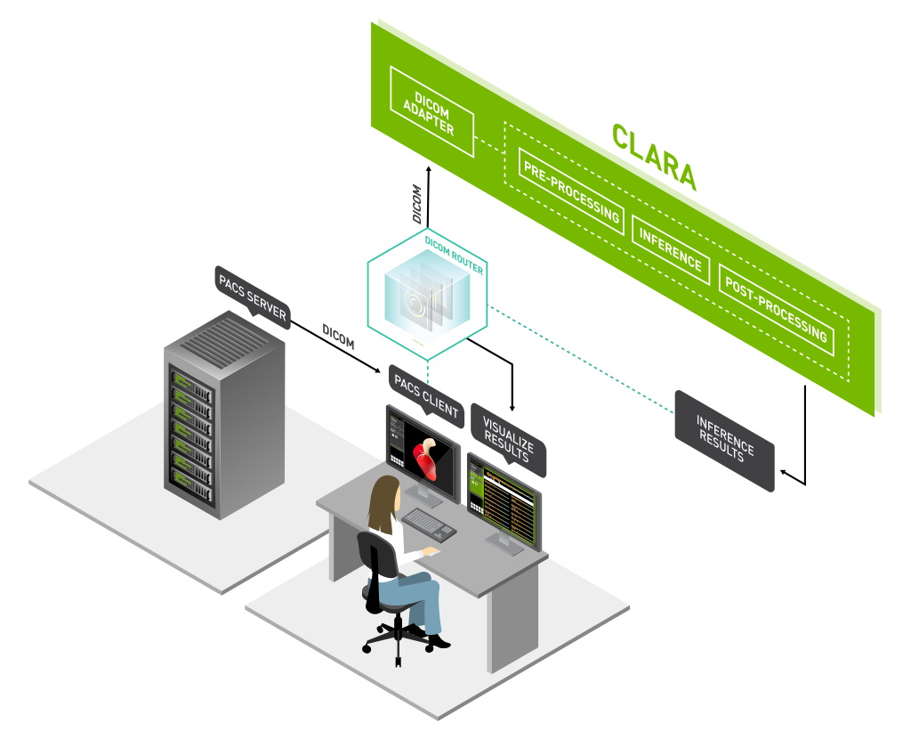

[](https://docs.nvidia.com/clara/deploy/index.html)


# Clara DICOM Adapter

[](LICENSE)
[](https://github.com/NVIDIA/clara-dicom-adapter)
[](https://codecov.io/gh/NVIDIA/clara-dicom-adapter)

Designed for the Clara Deploy SDK, the Clara DICOM Adapter implements the
necessary DICOM services for interoperability between Clara and other medical
devices. The Clara DICOM Adapter allows you to send/receive DICOM objects
using standard DICOM protocols and interpret standard DICOM part-10 formats.

## Additional Resources to Learn More on Clara Deploy

* [NVIDIA Clara Overview Homepage](https://developer.nvidia.com/clara)
* [NVIDIA Clara Deploy SDK User Guide](https://docs.nvidia.com/clara/deploy/index.html)

## Build

### Prerequisites

* [.NET Core 3.1 SDK](https://dotnet.microsoft.com/download/dotnet-core/3.1)
* DCMTK (Required for running integration test)


### Development Environment

DICOM Adapter follows the [Generic Host](https://docs.microsoft.com/en-us/aspnet/core/fundamentals/host/generic-host?view=aspnetcore-3.1) design with .NET Core.  In order for it to pickup `appsettings.Development.json` 
you must export the following environment variable before executing `dotnet run`:

```bash
export DOTNETCORE_ENVIRONMENT=Development
```


### Building Clara DICOM Adapter

```bash
src$ dotnet build
```

### Building Clara DICOM Adapter Docker Container

```bash
$ ./build.sh
```

### Running Unit Test

```bash
src$ ./run-tests-in-docker.sh [--unit|--integration]
# or 
src$ ./run-tests.sh  [--unit|--integration]
```

## Contributing

For guidance on making a contribution to Clara DICOM Adapter, see the [contributing guidelines](CONTRIBUTING.md).


## Licenses
- [NVIDIA License](LICENSE)
- [Individual Contributor License Agreement](https://www.apache.org/licenses/icla.pdf)
- [Open Source Licenses](docs/more/open-source-licenses.md)
